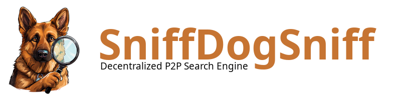

# SniffDogSniff
Sniff Dog Sniff is a customizable, decentralized search engine

## Warning: We decided to swith from GoLang to C++
## The current C++ version is incomplete 
## Please use the last stable GoLang Release tag

### How to use
* Building and running (see [Build and Install](docs/build.md))

* To simply run a local instance of the sniffdogsniff run:
```bash
sniffdogsniffd --config-file config.ini
```
* Start searching
To access the WebUi open a browser and go to 127.0.0.1:8081

### Documentation
* [Build and Install](docs/build.md)
* [Configuration file](docs/config_file.md)

### Code contribution
If you want to contribute the code you are Welcome!

